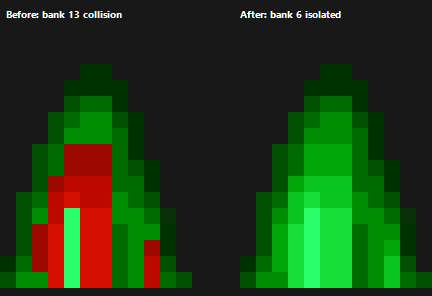

# 敵方深綠 Sprite／子彈混入紅色：修復結果

日期：2026-08-11
修復範圍：全關卡共用 OBJ palette ownership
驗證路線：Episode 3、Section 11（FLEET）

## 已完成修復

Boss 血條的 4bpp OBJ palette 已由 bank 13 搬至 bank 6。

- bank 13 繼續專供 8bpp Sprite2 的 PC hue 12／13，不再被 HUD 寫入。
- bank 6 原本屬於已退役、正式 source-parity renderer 不再使用的靜態
  `PLAYER_SHOT` atlas，因此可安全承接 Boss 血條。
- 資產建置器會把 Boss 血條 palette 真正烘入 bank 6，並輸出
  `OBJ_PAL_BOSS_BAR = 6`；不是只改 OAM 的 palette number。
- C 端新增動態 palette bank mask 與 `_Static_assert`。若未來 Boss 血條
  再被配置到任一 Sprite2 動態 bank，編譯會直接失敗。

## 精確驗證

FLEET 綠彈 primary shot graphic 118 的原始 `0xC0..0xCF` 色階，會映射至
bank 13。當中的 `0xC8..0xCD` 精確落在槽 4、5、6；舊版 Boss 血條也恰好
在每關初始化及受擊閃色時覆寫這三槽。因此下圖左側能完整重建使用者看到
的紅色直帶；搬移後右側保留原始綠階。

驗證項目：

- 完整資產重建成功，Sprite2 raw catalog round-trip 11,552／11,552。
- CUSTOM／Normal speed 正式設定可編譯。
- FLEET route 900 VBlank smoke test 通過，音樂保持 active。
- FLEET position 5030 與 5110 定點快速推進、Sprite2／Boss 組件呈現通過。
- 正式 ROM 已重建；目前使用者 SAV 的 SHA-256 建置前後完全相同。

## 產出

- ROM：`build/TyrianGBA.gba`
- Detail：CUSTOM
- Game speed：Normal
- ROM 大小：26.75 MiB
- ROM SHA-256：
  `7f9195ba902aa693fe553659010f0f2e51e84125b884a90b09d0c63f61042930`
- SAV SHA-256（未變更）：
  `139c0d36ffe1fc523991d99483e7e68ba5661017d033f2ddb698109ebf458fbf`
