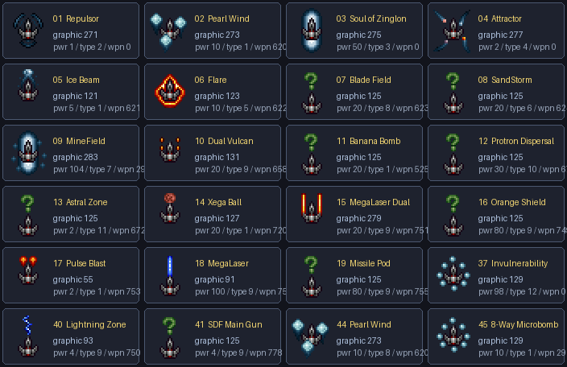
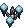

# Tyrian Special Weapon 資料、屬性與 HUD 顯示規則

日期：2026-08-04（2026-08-16 更新 Twiddle 與隱藏武器流程）
適用範圍：PC OpenTyrian 原始規格與 TyrianGbaPoc 目前移植狀態

## 結論

Tyrian 的 `Special Weapon` 是一個獨立裝備槽，同一時間只會裝備一項。PC 版在遊戲畫面左上角，使用該項目的 `itemgraphic` 從 `spriteSheet10` 拼成 24×28 圖示。四個 Episode 的名稱與圖示編號一致；47 筆定義中：

- ID 0 是 `None`。
- 24 筆具有非零 `itemgraphic`，能顯示正常左上角圖示。
- 22 筆的 `itemgraphic=0`，多半是 Super Arcade、事件、雙人或內部輔助定義，沒有可供 HUD 使用的專屬圖示。
- ID 32 `MicroSol Option2` 是唯一 Episode 屬性差異：Episode 1–3 為 `stype=18`，Episode 4 為 `stype=17`；名稱、武器與圖示狀態不變。

下圖完全由原始 `tyrian.shp` 的 `10_powerups` Sprite2 bank 導出；沒有重畫、量化或替換圖形。



部分項目共用綠色問號圖形（graphic 125）。這是原始 Tyrian 素材本身的設計，不是解包錯誤或 GBA 調色盤問題。

## HDT 欄位意義

每筆 Special Weapon 記錄為 37 bytes：

| 欄位 | 大小 | 意義 |
|---|---:|---|
| `name` | 31 bytes | Pascal 長度加最多 30 bytes CP437 名稱 |
| `itemgraphic` | `u16` | `spriteSheet10` 的一基底 Sprite2 編號；0 表示沒有圖示 |
| `pwr` | `u8` | `SFExecuted` 指令路徑的成本編碼；部分 `stype` 也把解碼值用於持續時間或冷卻 |
| `stype` | `u8` | Special 行為分派編號 |
| `wpn` | `u16` | HDT Weapon 或 Option 定義編號；實際意義由 `stype` 決定 |

### `pwr` 不是單純威力值，且 PC 有兩條啟動路徑

PC `JE_doSpecialShot()` 先處理鍵盤 twiddle 產生的 `SFExecuted`，再處理
左上角目前裝備 Special 的一般按鍵。只有 `SFExecuted` 進入支付與
`shotMultiPos` 歸零區塊；一般裝備按鍵不扣 Shield／Armor，也不重設射擊
phase。這兩條路徑不可合併。

`SFExecuted` 的真實支付規則如下：

| `pwr` | 啟動成本／效果輸入 |
|---:|---|
| 0 | 免費 |
| 1–97 | 扣除相同數量的 Shield；不足則不能啟動 |
| 98 | 至少要有 4 Shield，啟動後耗盡全部 Shield；原 Shield 量成為後續效果值 |
| 99 | Shield 留下一半；取整後的一半成為後續效果值 |
| 100–255 | 扣除 `pwr-100` Armor，而且必須至少保留 1 Armor |

因此 `pwr=104` 代表消耗 4 Armor，不是「104 點威力」。`pwr=100` 的實際扣除量是 0，但仍要求玩家 Armor 大於 0。

原始 C 版的一般裝備路徑還有一個共用暫存變數問題：`stype` 12、13、16
會讀取未在該路徑設定的全域 `temp2`，結果取決於同一幀稍早碰巧執行的程式。
GBA 保留「不付款、不重設 phase」的外部行為，但以相同 `pwr` 編碼規則
穩定產生效果輸入而不異動資源：98 取目前 Shield、99 取目前 Shield 的一半、
100 以上取 `pwr-100`。因此 Invulnerability 不會因暫存值污染而忽長忽短，
也不會把 98 誤當成 980 tick。

## `stype` 行為分派

| `stype` | PC 原始行為 |
|---:|---|
| 1 | 直接發射 `wpn` 指定的 Weapon |
| 2 | Repulsor：把所有有效敵彈的速度往遠離玩家的方向修正一次 |
| 3 | Soul of Zinglon：啟動 50 tick 的縱向 Zinglon 光束與專屬音效，Special 冷卻 100 tick |
| 4 | Attractor：讓所有可收集且有價值的 `scoreitem` 加速朝玩家移動 |
| 5 | Flare：filter 7、頻率 2、持續 50 tick，隨機位置發射 `wpn` |
| 6 | SandStorm：filter 1、頻率 7，持續 `200 + 25×前武器等級` tick |
| 7 | MineField/Zinglon field：filter 3、頻率 3，持續 `50 + 10×前武器等級` tick，並啟動 Zinglon 效果 |
| 8 | 無濾鏡的短時間隨機武器場；頻率 7，持續 `10 + 前武器等級` tick |
| 9 | 與玩家位置連結的武器場；持續 `8 + 2×前武器等級` tick，`pwr` 同時成為追加等待時間 |
| 10 | 與玩家位置連結的武器場；持續 `14 + 4×前武器等級` tick |
| 11 | Astral Zone 隨機武器場；頻率為 `pwr`，並維護獨立 Astral 計時 |
| 12 | 無敵；一般模式持續 `pwr 解碼效果值×10` tick，Super Arcade 另有固定 100 tick 與 Weapon 707 行為 |
| 13 | 修復 Player 1 Armor，修復量為 `pwr 解碼效果值/4 + 1` |
| 14 | 修復 Player 2 Armor；GBA 單人版刻意不實作 Player 2 |
| 16 | 連結玩家的散射場；持續 `pwr 解碼效果值×16 + 8` tick，生成彈丸另加隨機 X/Y 速度 |
| 17 | 若左 Option 已是 `wpn`，再裝到右側；否則裝到左側 |
| 18 | 直接把 `wpn` 裝到右側 Option |

### Soul of Zinglon 的光柱與傷害規則

PC `JE_doSpecialShot()` 並不是畫數條獨立直線。它以玩家機身
`x+7` 為中心，在完整戰鬥高度連續執行兩次 `JE_barBright()`：

- `halfWidth = 25 - abs(zinglonDuration - 25)`，50 tick 內由窄變寬、再由寬變窄；
- 外層比內層左右各多 2 pixel；
- `JE_barBright()` 保留底下像素的色相，只提高亮度，因此畫面應是實心、可透視背景與敵人的白亮縱向光柱；
- 遞減後只有 `zinglonDuration % 5 == 0` 才啟用一次合成武器槽的碰撞，因此不是每 tick 都造成傷害；
- 每次脈衝使用 filter 9、damage 10。Armor 10 以下會摧毀；更強的目標可觸發 damaged transition，但 PC 原碼刻意不逐次扣除其 Armor。

GBA 版以 `WIN0 + hardware brightness increase` 裁出同一個實心縱向區域，
直接增亮 BG／OBJ 的既有像素，不再使用原先錯誤的六條線段近似。GBA 只有一組
全域 `BLDY`，所以用 `BLDY=5` 平滑近似 PC 內層 +4、外緣 +2 的雙階亮度；
形狀、生命週期、五 tick 傷害節奏與 Armor 規則則依 PC 原始流程保留。

## 會顯示左上角圖示的 24 項

「SFExecuted 成本」欄依 PC 原始 `pwr` 規則解碼，只適用鍵盤 twiddle／
指令路徑；左上角裝備按鍵不付款。「前武器等級」指目前 Front Weapon Power。

| 圖示 | ID／名稱 | 原始屬性 | SFExecuted 成本 | 行為摘要 |
|---|---|---|---|---|
|  | 1 Repulsor | graphic 271; pwr 1; type 2; wpn 0 | Shield 1 | 對所有有效敵彈施加一次遠離玩家的速度修正。 |
|  | 2 Pearl Wind | graphic 273; pwr 10; type 1; wpn 620 | Shield 10 | 直接發射 Weapon 620。 |
|  | 3 Soul of Zinglon | graphic 275; pwr 50; type 3; wpn 0 | Shield 50 | 50 tick 的 Zinglon 縱向光束與專屬音效，冷卻 100 tick。 |
|  | 4 Attractor | graphic 277; pwr 2; type 4; wpn 0 | Shield 2 | 使有效金錢、獎賞等 `scoreitem` 的速度朝玩家修正一次。 |
|  | 5 Ice Beam | graphic 121; pwr 5; type 1; wpn 621 | Shield 5 | 直接發射 Weapon 621。 |
|  | 6 Flare | graphic 123; pwr 10; type 5; wpn 622 | Shield 10 | filter 7、頻率 2、50 tick 的全畫面 Flare 武器場。 |
|  | 7 Blade Field | graphic 125; pwr 20; type 8; wpn 623 | Shield 20 | 無濾鏡隨機 Blade 場，持續 `10 + 前武器等級` tick。 |
|  | 8 SandStorm | graphic 125; pwr 20; type 6; wpn 624 | Shield 20 | filter 1、頻率 7，持續 `200 + 25×前武器等級` tick。 |
|  | 9 MineField | graphic 283; pwr 104; type 7; wpn 29 | Armor 4 | filter 3 的 MineField，並同時啟動 Zinglon 效果。 |
|  | 10 Dual Vulcan | graphic 131; pwr 20; type 9; wpn 658 | Shield 20 | 玩家連結型 Weapon 658 場；持續 `8 + 2×前武器等級`，追加等待 20 tick。 |
|  | 11 Banana Bomb | graphic 125; pwr 20; type 1; wpn 525 | Shield 20 | 直接發射 Weapon 525。 |
|  | 12 Protron Dispersal | graphic 125; pwr 30; type 10; wpn 670 | Shield 30 | 玩家連結型 Weapon 670 場；持續 `14 + 4×前武器等級` tick。 |
|  | 13 Astral Zone | graphic 125; pwr 2; type 11; wpn 672 | Shield 2 | 隨機 Weapon 672 場；頻率 2，並啟動 Astral 計時。 |
|  | 14 Xega Ball | graphic 127; pwr 20; type 1; wpn 720 | Shield 20 | 直接發射 Weapon 720。 |
|  | 15 MegaLaser Dual | graphic 279; pwr 20; type 9; wpn 751 | Shield 20 | 玩家連結型 Weapon 751 場，追加等待 20 tick。 |
|  | 16 Orange Shield | graphic 125; pwr 80; type 9; wpn 749 | Shield 80 | 玩家連結型 Weapon 749 場，追加等待 80 tick。 |
|  | 17 Pulse Blast | graphic 55; pwr 2; type 1; wpn 753 | Shield 2 | 直接發射 Weapon 753。 |
|  | 18 MegaLaser | graphic 91; pwr 100; type 9; wpn 754 | Armor 0，但需 Armor > 0 | 玩家連結型 Weapon 754 場，追加等待 100 tick。 |
|  | 19 Missile Pod | graphic 125; pwr 80; type 9; wpn 755 | Shield 80 | 玩家連結型 Weapon 755 場，追加等待 80 tick。 |
|  | 37 Invulnerability | graphic 129; pwr 98; type 12; wpn 0 | 全部 Shield；至少需 4 | 無敵時間為啟動前 Shield 數量×10 tick；Super Arcade 使用另一套固定規則。 |
|  | 40 Lightning Zone | graphic 93; pwr 4; type 9; wpn 750 | Shield 4 | 玩家連結型 Weapon 750 場，追加等待 4 tick。 |
|  | 41 SDF Main Gun | graphic 125; pwr 4; type 9; wpn 778 | Shield 4 | 玩家連結型 Weapon 778 場，追加等待 4 tick。 |
|  | 44 Pearl Wind | graphic 273; pwr 10; type 8; wpn 620 | Shield 10 | 與 ID 2 共用名稱和圖示，但改為短時間隨機 Weapon 620 場。 |
|  | 45 8-Way Microbomb | graphic 129; pwr 10; type 1; wpn 29 | Shield 10 | 直接發射 Weapon 29。 |

## 沒有左上角素材的 22 項

這些定義仍可能由事件或 Super Arcade 流程使用，但 `itemgraphic=0`，所以不能當作一般 2×2 HUD 圖示解碼。下表的「消耗」同樣只描述 `SFExecuted` 指令路徑；事件或裝備路徑不會自動支付。

| ID／名稱 | pwr | stype | wpn | 來源行為摘要 |
|---|---:|---:|---:|---|
| 20 Minefield | 104 | 16 | 710 | 消耗 4 Armor；玩家連結的散射 Weapon 710 場。 |
| 21 Post-It Blast | 105 | 1 | 708 | 消耗 5 Armor；直接發射 Weapon 708。 |
| 22 Drone ** | 103 | 12 | 0 | 消耗 3 Armor；一般 type 12 路徑給 30 tick 無敵，Super Arcade 有額外 Weapon 707 行為。 |
| 23 Repair Player 1 | 98 | 14 | 0 | 名稱如此，但 `stype=14` 的原始碼實際修復 Player 2；GBA 單人版不執行。 |
| 24 Super Bomb | 104 | 5 | 622 | Special 定義中的 Flare 型 Weapon 622；不是關卡內可累積的 Super Bomb 庫存。 |
| 25 Hot Dog | 101 | 1 | 711 | 消耗 1 Armor；直接發射 Weapon 711。 |
| 26 Lightning UP | 0 | 1 | 721 | 免費直接發射 Weapon 721。 |
| 27 Lightning UP+LEFT | 0 | 1 | 722 | 免費直接發射 Weapon 722。 |
| 28 Lightning UP+RIGHT | 0 | 1 | 723 | 免費直接發射 Weapon 723。 |
| 29 Lightning LEFT | 0 | 1 | 724 | 免費直接發射 Weapon 724。 |
| 30 Lightning RIGHT | 0 | 1 | 725 | 免費直接發射 Weapon 725。 |
| 31 MicroSol Option | 0 | 17 | 19 | 把 Option 19 裝到左側，若左側已有則裝右側。 |
| 32 MicroSol Option2 | 0 | 18／17 | 26 | Episode 1–3 直接裝右側；Episode 4 改為左側優先、已有才裝右側。 |
| 33 MicroSol Option3 | 0 | 17 | 21 | 把 Option 21 裝到左側，若左側已有則裝右側。 |
| 34 MicroSol Option4 | 0 | 18 | 22 | 直接把 Option 22 裝到右側。 |
| 35 MicroSol Option5 | 0 | 18 | 23 | 直接把 Option 23 裝到右側。 |
| 36 MicroSol Option6 | 0 | 18 | 25 | 直接把 Option 25 裝到右側。 |
| 38 Atom Bomb | 102 | 1 | 19 | 消耗 2 Armor；直接發射 Weapon 19。 |
| 39 Seeker Bombs | 103 | 1 | 709 | 消耗 3 Armor；直接發射 Weapon 709。 |
| 42 Ice Blast | 4 | 1 | 706 | 消耗 4 Shield；直接發射 Weapon 706。 |
| 43 Repair Player 1 | 98 | 13 | 0 | 耗盡 Shield，修復 Player 1 Armor：`原 Shield/4 + 1`。 |
| 46 Protron Field | 99 | 1 | 707 | Shield 留下一半；直接發射 Weapon 707。 |

## 左上角圖示與狀態燈

PC 每幀有兩個獨立的顯示：

1. `JE_inGameDisplays()` 在 `(25,1)` 以 `blit_sprite2x2()` 畫目前 Special 的 `itemgraphic`。
2. `JE_doSpecialShot()` 在 `(47,4)` 畫獨立狀態燈：Special 可用時為 graphic 94，冷卻／作用中為 graphic 93。

| 狀態 | 原始圖示 |
|---|---|
| Ready，graphic 94 |  |
| Cooling down／active，graphic 93 |  |

目前 GBA 已使用 HDT `itemgraphic` 與原始 2×2 Sprite2 拼法顯示裝備圖示，也已把 PC 的 93／94 獨立 Ready 燈接到同一組左上角 HUD。判斷順序保留 PC 行為：先依 `shotRepeat[SPECIAL]`、`specialWait`、`flareDuration`、`zinglonDuration` 判斷本幀圖形，再遞減計時器。

GBA 現有的 gamepad Special 鍵對應 PC 的「目前裝備 Special」路徑，因此不會
扣 Shield／Armor，也不會把多段武器的 `shotMultiPos` 歸零。`SFExecuted`
支付區塊與單人船 Twiddle 解碼器已依 PC 原碼分開接回：GBA 十字鍵代表方向、
A 代表主射擊，26 組 `keyboardCombos`、14 艘船的三組 `shipCombos`、按住同方向
不取消、放開鍵 token 9、完成後等待 Special 冷卻再執行等規則均保留。不能把
這條支付路徑誤接到一般裝備按鍵；L 仍只觸發左上角目前裝備的 Special。

## Banana／Hot Dog 隱藏取得流程

這四個主武器／Special 並不是普通商店庫存。逐一解析四個 `levelsN.dat` 的
`]I` 清單後，Front／Rear 商品群組都沒有 23–26；GBA 因此不把它們硬塞進
Upgrade Ship，而是保留 PC 的隱藏流程：

1. Episode 4 完成並循環回 Episode 1 時，`JE_nextEpisode()` 有 **1/6** 機率把
   玩家改成 SuperCarrot（Ship 2）、Front 23 `Banana Blast`、Rear 24
   `Banana Blast Rear`，兩門武器 Power 均重設為 1。GBA 現在使用同一個關卡
   MT 隨機串流執行此分支，並同步更新下一關路線船型與前端圖形快取。
2. SuperCarrot 的原版 Twiddle 是 **UP，接著 DOWN+A**。完成後執行 Special 25
   `Hot Dog`（Weapon 711），依 `pwr=101` 支付 1 Armor，且 Armor 必須至少
   留 1；若 Special 尚在冷卻，完成的指令會保留到可執行時，不會被單幀吃掉。
3. Episode 3 `SAWBLADES` 路線另有原始敵人掉落 `evalue=-5`。拾取後會直接把
   Front／Rear 改成 25 `HotDog`／26 `HotDog Rear`；這條既有掉落流程維持不變。

玩家實際持有的隱藏武器仍會由 Upgrade Ship 的「補入目前裝備」規則出現在
對應子選單，方便保留或換下；這不等於把它永久加入該關商店商品清單。

## `Super Bomb` 的兩套不同機制

名稱相近但不可混為一談：

| 機制 | 資料與保存 | HUD |
|---|---|---|
| Special ID 24 `Super Bomb` | 一般 `player_special` 裝備定義；`itemgraphic=0` | 沒有左上角專屬圖示 |
| 關卡掉落 Super Bomb | 敵人 `evalue=-4`；`player_superbombs` 最多 10，使用 Weapon 535，每關重置且不寫存檔 | 每顆用 `spriteSheet9` graphic 304 排列 |

關卡庫存使用的原始 graphic 304：


## GBA 目前移植稽核

| 項目 | 狀態 |
|---|---|
| HDT Special 讀取 | 已從 ROMFS 的 Episode item database 讀取 |
| 關卡特殊掉落 `evalue > 32100` | 已把 `evalue-32100` 寫入 `player_special` |
| 跨關與 SRAM 保存 | 已保存目前 Special ID |
| 24 筆有效圖示 | 已使用原始 Sprite2 資料顯示於左上角 |
| 24 項 HUD Special 的 `stype` 1–12 | 已逐項覆蓋；不以籠統的「1–18 都完成」取代依賴稽核。非 HUD 定義中的 Player 2 type 14 依 GBA 單人規格省略，type 13、16–18 仍保留其資料分派 |
| 兩條啟動路徑 | 一般裝備 L 鍵不付款、不重設射擊 phase；D-pad+A 的完整單人船 Twiddle 才建立 `SFExecuted` 並使用支付區塊。兩者已分開測試 |
| PC Twiddle 指令 | 26×8 原始 token 表與 14×3 船型表已移植；完成結果會跨冷卻 tick 保留，SuperCarrot `UP, DOWN+A` 可正確觸發 Hot Dog |
| PC Shield／Armor 支付區塊 | `SFExecuted` 已完整移植 `pwr` 0、1–97、98、99、100–255 的可負擔判斷、扣除順序與付款後效果值；未錯接到 gamepad 裝備路徑 |
| Banana／HotDog 取得 | Episode 4 循環的 1/6 SuperCarrot＋Banana 獎勵與 Episode 3 SAWBLADES `evalue=-5` HotDog 掉落均保留；普通商店不偽造 23–26 庫存 |
| PC graphic 93／94 Ready 狀態燈 | 已使用原始 `spriteSheet9` graphic 94／93 顯示 Ready／冷卻或作用中狀態 |
| Soul of Zinglon | 已改為硬體視窗實心增亮光柱；寬度、50 tick 生命週期、每 5 tick 傷害脈衝與特殊 Armor 行為同步 PC 原碼 |
| Xega Ball／Banana Bomb | 從 ROMFS 原始 `tyrian.shp` 精確載入 OptionShapes graphic 21／33；分別保留 55×54 與 80×79 像素、碰撞範圍及多片 OAM 組合 |
| Astral Zone | 依 PC 順序遮蔽 background 1、強制 100-star overlay，後續背景層與物件仍正常繪製 |
| Invulnerability | 依 PC 更新／繪製順序維持透明閃爍；`pwr=98` 使用目前 Shield 推導時間，但一般裝備路徑不扣 Shield |
| Episode 4 Ice／superpixel | 已移植 101 格循環覆寫池、固定點移動、生命週期、五粒爆散及 16 色 hue；命中 Armor 255 的粒子回饋亦已接回 |
| Weapon filter／命中回饋 | `shipblastfilter` 使用原始高 nibble，低 nibble 保留素材索引；filter、爆散與 Armor 255 規則不再混用 |
| 多段射擊與 pool-full | `shotMultiPos` 跨一般裝備觸發持續推進；彈池滿時不錯誤啟動 cooldown，部分配置失敗也不修改錯誤彈槽 |
| Sprite2／OptionShapes 快取 | 只掃描各 Weapon 的 live `max` slots，遞迴展開 attack chain；借用 L2 slot 前失效舊 metadata，並依關卡資源需求保留 graphic 21／33 |

LOW 細節 autotest 已覆蓋 Twiddle token／取消／跨 tick pending，以及
`SFExecuted` 的 Shield 直接扣除與不足、
`pwr=98` 足夠／不足、`pwr=99`、Armor 足夠／不足，以及 Zinglon 寬度／
五 tick 傷害相位等邊界案例；也直接驗證一般裝備 Xega 不付款且 phase
由 2 推進到 4，以及 Invulnerability 以目前 Shield 37 取得 370 tick、資源不變。
SRAM `telemetry_upgrade_loadout_pass=1`。另以無射擊的完整裝備壓力場景
確認 graphic 94 可見，180 display frames 期間素材、Sprite2 L2、敵機與彈丸
快取皆無 drop。

Episode-wrap 決定性測試會固定命中 1/6 分支，驗證 Episode 4 Section 44 的
原始 Skip It／故事／Episode announcement 流程完成後，Episode、section、
route ship 與實際裝備同步成 Episode 1、Section 1、Ship 2、Front 23 Power 1、
Rear 24 Power 1；正式 ROM 不固定亂數結果。

GBA 的 superpixel 畫在 sparse 4bpp BG3，避免再消耗已吃緊的 OAM。位置、
色相、十字形狀與生命週期依 PC 資料；但 GBA 不能在這條 tile 路徑逐像素讀取
下層畫面的即時亮度，所以亮度混合採固定中間值近似。這是明確的平台適配，
不是遺漏某一項 Special 的效果。

## 可重現 24 項 runtime 依賴稽核

執行：

```powershell
.\.venv\Scripts\python.exe tools\audit_special_weapon_runtime.py
```

稽核器直接解析四個 Episode 的原始 item／weapon 資料，從 24 個 HUD Special
逐層走訪 live weapon slots 與 attack chain；不使用人工維護的每關 catalog。
目前結果必須同時滿足：24 個 ID 完整、88 筆 Episode/Weapon 可達記錄、
OptionShapes 只需 graphic 21／33、Episode 4 superpixel hue 9 合法，以及所有
HUD `stype` 都有 runtime 分派。任一資料索引、依賴或支援表退化時，腳本會以
非零 exit code 讓建置／人工稽核立即失敗。

## 可重現素材導出

執行：

```powershell
.\.venv\Scripts\python.exe tools\export_special_weapon_reference.py
```

腳本會：

1. 分別解析 Episode 1–3 的 `tyrian.hdt` 與 Episode 4 `tyrian4.lvl` item database。
2. 驗證四個 Episode 的 Special 名稱與 `itemgraphic` 一致。
3. 從 `vendor/tyrian/image/sheets/10_powerups` 依 `graphic,+1,+19,+20` 組合 24×28 原始圖示。
4. 導出每個獨立 PNG、總覽圖、Ready／Cooldown 燈和 Super Bomb 庫存圖示。

## 主要來源

- PC 結構與 HDT loader：[`episodes.h`](../../vendor/opentyrian/src/episodes.h)、[`episodes.c`](../../vendor/opentyrian/src/episodes.c)
- PC Special 行為、成本與 Ready 狀態：[`varz.c`](../../vendor/opentyrian/src/varz.c)
- PC Twiddle 解碼與 Episode 循環獎勵：[`mainint.c`](../../vendor/opentyrian/src/mainint.c)
- PC 左上角圖示：[`mainint.c`](../../vendor/opentyrian/src/mainint.c)
- PC 2×2 Sprite2 拼法：[`sprite.c`](../../vendor/opentyrian/src/sprite.c)
- GBA HDT reader：[`opentyrian_data.c`](../../src/opentyrian_data.c)
- GBA Special runtime：[`combat_runtime.inc`](../../src/combat_runtime.inc)
- GBA Twiddle 解碼器：[`combat_twiddle.inc`](../../src/combat_twiddle.inc)
- GBA HUD：[`gba_scene.inc`](../../src/gba_scene.inc)
- 素材導出器：[`export_special_weapon_reference.py`](../../tools/export_special_weapon_reference.py)
- 24 項 runtime 依賴稽核器：[`audit_special_weapon_runtime.py`](../../tools/audit_special_weapon_runtime.py)
