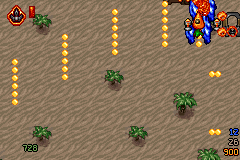
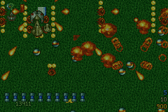
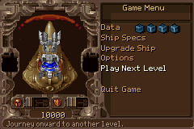
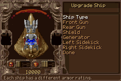

# TyrianGbaPoc

[Official website](https://erspicu.github.io/TyrianGbaPoc/) ·
[Latest release (v89)](https://github.com/erspicu/TyrianGbaPoc/releases/tag/v89) ·
[Build guide](BUILDING.md)

TyrianGbaPoc is an in-progress Game Boy Advance port of Tyrian, driven by the
original Tyrian 2.1 data and OpenTyrian source behaviour.

This project originally began as a technical experiment: could the PC version
of Tyrian be brought to the GBA as faithfully as possible despite the
handheld's much tighter CPU, memory, video and audio limits? After overcoming
a long series of rendering, streaming, cache, timing and asset-pipeline
problems, the answer proved to be yes. The project therefore changed direction
from a one-level proof of concept to an effort to build a broadly complete,
maintainable and source-faithful GBA port.

It remains an active fan project rather than an official release. The main
frontend, save/load, campaign and combat flows are connected, all 62 playable
stock sections participate in data regression, and uncommon routes and
equipment combinations continue to receive source-parity QA.

## Current LOW-detail build

All images below are unmodified 240x160 captures from the current GBA ROM in
mGBA. The public v89 build uses the production **LOW Detail / Normal Speed**
profile, normal damage, and normal campaign equipment.

| Live combat | Multi-part boss stress |
|---|---|
|  |  |

| Source-driven Game Menu | Upgrade Ship |
|---|---|
|  |  |

## What already works

- Original logo, new-game setup, Game Menu, Options, eleven-slot SRAM
  Save/Load, Next Level, Demo and JukeBox flow.
- Stock MUS/SHP/PIC/HDT/LVL data loaded from a cartridge ROMFS.
- Source-driven level events, four enemy pools, movement, projectiles,
  collision, damage, linked destruction, rewards, bosses and end-level flow.
- Three independently scrolling background layers and the original gameplay
  draw-order semantics adapted to GBA BG/OBJ priorities.
- A 1:1 centre crop of the PC gameplay viewport: gameplay coordinates remain
  source coordinates and the GBA performs only the final 240x160 crop.
- All 128 GBA OAM entries, palette-aware Sprite2 caching and build-time
  lossless expansion of the stock shape banks.
- All 41 music tracks with all nine authored OPL2 source channels retained,
  plus stock sound effects and voices through an 18-slot Maxmod mixer.
- Fixed-timestep gameplay with controlled frame dropping under unusually heavy
  scenes, without slowing the game clock.
- Automated mGBA regressions for gameplay, episodes, menus, Demo, JukeBox,
  death/end-level flow, ROMFS coverage and performance telemetry.

The implementation treats OpenTyrian as the gameplay specification. Platform
changes are kept in GBA presentation, input, audio, storage and performance
adapters instead of replacing authored level behaviour with per-level tables.

## Build

On Windows 10/11 with Python 3.10 or newer, run:

```text
Build-GBA-ROM.bat
```

The first run installs a pinned ARM compiler inside the project. The final ROM
is written to `build/TyrianGBA.gba`; previous local ROMs are moved to
`Backup/`. No system-wide GBA SDK installation is required.

For environment details, directory layout, advanced options and full
regression commands, see [BUILDING.md](BUILDING.md).
Developer switches and all supported HUD/menu coordinates are documented
directly in the bilingual [Configure.h](Configure.h).

The optional Windows [TyrianSaveEditor](TyrianSaveEditor/README.md) provides
both a WinForms UI and CLI for creating, inspecting and editing emulator
`.sav` files without weakening the game's dual-bank/CRC format.

## Controls

- D-pad Up/Down: select menu items
- A or Start: confirm
- B: go back

During play:

- D-pad: move in eight directions
- A: fire the Front and Rear main weapons
- B: fire both Sidekicks
- L: activate the equipped Special Weapon
- R: use one carried Super Bomb
- Select: switch the Rear Weapon mode when the equipped port supports it
- Start: pause/resume

The original ship-specific Twiddle commands are also recognized through
D-pad directions plus A, independently of the equipped-Special L button.
For example, SuperCarrot's Up, then Down+A command fires Hot Dog and pays
its source-authored Armor cost.

Infinite-ammo Sidekicks retain OpenTyrian's source-authored main-fire link.
Set `TYRIAN_GBA_GAMEPAD_FULL_AUTO_SIDEKICKS` to `1` in `Configure.h` if A
should also command ammo-limited Sidekicks. Recorded PC demos retain their
original independent left/right Sidekick inputs rather than using this
physical GBA mapping.

Save-name editor:

- Up/Down: cycle the current character
- Hold R while pressing Up/Down: choose an uppercase letter
- A or Right: advance the cursor
- Left: move the cursor back
- B: erase; at the first character, return without saving
- Start: save
- Hold Select: clear the whole name

`Load Game` on the title page opens the real 11-slot SRAM browser. Loading an
occupied slot restores the campaign and continues at Game Menu; `B` returns to
the highlighted title item. The same load browser remains available through
`Game Menu > Options > Load`.

## Downloads

The current formal release is
[v89 — Full 9-Channel Audio Release](https://github.com/erspicu/TyrianGbaPoc/releases/tag/v89).
Its LOW-detail ROM is published as a GitHub Release asset rather than committed
to the source tree:

- [Download `TyrianGBA-v89-low.gba`](https://github.com/erspicu/TyrianGbaPoc/releases/download/v89/TyrianGBA-v89-low.gba)
- Size: 27,090,252 bytes (25.835 MiB)
- SHA-256: `e2440d9b393723b31735c58e343f4465863e4c5188348156990db7a4bf08f7b0`

Use legally obtained Tyrian data and an emulator or hardware environment
appropriate for your jurisdiction.

## Project layout

- `src/`, `main.c`: GBA runtime and source-parity translation.
- `vendor/`: pinned Tyrian data, OpenTyrian snapshot, SDK and build inputs.
- `tools/`: reproducible asset/build/test scripts.
- `TyrianSaveEditor/`: source-data-backed WinForms and CLI SRAM editor.
- `MD/`: detailed parity, architecture and performance research notes.
- `Website/`: bilingual official project website source and current capture
  gallery.

Third-party licenses and upstream locations are listed in
[THIRD_PARTY_NOTICES.md](THIRD_PARTY_NOTICES.md). This project is based in
part on work from OpenTyrian, devkitPro/libgba, Maxmod and mGBA. Tyrian and
its original assets remain the property of their respective rights holders.
